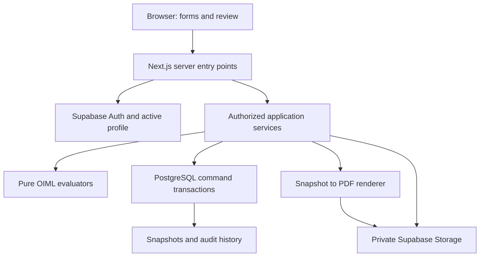

# SIH26035 - NAWI Lab master blueprint

Prepared for Abhinay Kumar's internal hackathon. Working stack: Next.js App Router + TypeScript + Supabase PostgreSQL/Auth/Storage + Vercel. Working title: NAWI Lab; branding can be changed later without changing the architecture.

This pack is a build specification and schema foundation, not a deployed application. The source PDFs were extracted, their structure inspected, and the selected MVP clauses and report tables checked, including visual review of key pages. This is not an exhaustive implementation or validation of every OIML clause. Source hashes are in source-manifest.json. The synthetic fixture arithmetic was independently checked with Python Decimal (66 assertions). Supabase SQL, application integration and Vercel deployment still require execution in your environment.

## 1. Understanding of SIH26035

We are building software for the laboratory's test-data-to-report process: register a submitted NAWI specimen, record technical characteristics and laboratory conditions, capture observations from actual testing, calculate deterministic results, review the evaluation record and generate/retrieve a Type Evaluation Test Report. The uploaded PS explicitly calls for RBAC, validation, automated limits/results, report repository/history, dashboard, evidence, future standard updates, PDF and editable exports. It calls digital signatures optional. Source: supplied SIH26035.pdf pp1-2.

The principal output is a Type Evaluation Test Report. A Model Approval Certificate is a separate regulatory output and is outside this prototype. The supplied PS does not specify a mandatory two-officer software workflow, report numbering scheme, QR code, database state names or legal effect of clicking Approve. Those are software choices. We will not claim the web app confers regulatory approval.

Source order: supplied problem statement for project requirements; supplied R76-1:2006 for requirements/procedures; supplied R76-2:2007 for report structure; other supplied official sources if later provided. SWOT and research are secondary planning notes and cannot authorize formulas. In particular the supplied PS theme is Miscellaneous; secondary notes claiming Smart Vehicles do not override it.

The uploaded R76-1 has 144 PDF pages; R76-2 has 62 PDF pages. A completed report does not have a fixed 54/62/64-page length: R76-2 p4 explicitly describes repeated forms and range-specific forms. Edition/publication page numbers and generated report page numbers are separate fields.

Indian-specific procedure, statutory signatory authority, prescribed Indian report format, fee rules, legally valid digital signatures and regulatory acceptance are **NOT VERIFIED FROM PROVIDED AUTHORITATIVE SOURCE**. The supplied PS mentions Indian laws, but the full legal texts and an institution's SOP were not supplied. Do not turn those references into guessed legal logic.

## 2. End-to-end real-world workflow

### Official / standard-driven sequence

| Activity | Supplied primary source | Meaning for the system |
|---|---|---|
| Applicant submits representative instrument and applicable documentation | R76-1 8.2.1, pp80-81 | Preserve model, specimen and application identities separately |
| Examine documentation | Annex A.1, p85 | Intake/document checklist, observations and supporting material |
| Compare construction with submitted documents | A.2, p85; 8.2.2, p82 | Record actual examination, not auto-pass from form completion |
| Record metrological characteristics and check markings/securing arrangements | A.3, p85; R76-2 pp6-7 | Capture declared class, Max/Min/e/d, features and manual findings |
| Determine relevant tests/examinations | 3.10, p36 onward; 8.2.2, p82 | Complete instruments use Annex A and applicable Annex B; software-controlled devices also involve 5.5/Annex G |
| Establish equipment and conditions | 3.7.1 p32; A.4.1 pp85-86; R76-2 pp4,8 | Record traceable test equipment and actual conditions |
| Perform physical tests and capture observations | Applicable Annex A/B procedures | Software assists and records; it does not physically conduct a weight/environment test |
| Calculate and evaluate observations | Relevant requirement + matching procedure/form | Use test-specific rules, units and verdicts |
| Compile results, summaries and examinations | R76-2 pp4-10 and relevant forms/checklists | Preserve omissions, negative findings and report traceability |
| Report supports approval assessment | R76-2 Introduction p4 | The report is evidence for an authority; certificate issuance is separate |

This is not one universal sequence of every test. There are test-specific prerequisites and ordering rules. For example R76-1 3.10.1 p36 puts endurance after all the other Annex A/B tests. The software must preserve such dependencies when more tests are added.

### Software workflow we are designing

Tester registration -> document/specification intake -> scoped plan -> physical-test observations -> server validation/calculation -> completed selected tests -> frozen submission snapshot -> senior-officer review -> correction/retest if requested -> approve report for issue -> render/store final PDF -> repository and audit.

We add independent review and locking to make the report process defensible. This does not change a test result or create a Model Approval Certificate. A failed test can be complete, and a report accurately recording failures can be approved for issue with a comment.

## 3. MVP

P0 is one complete workflow with three deeply implemented tests. The baseline profile is a complete digital class III single-interval ordinary platform instrument, without auxiliary indication, e=d, e>=5 g, Max<1000 kg, at most four support points, no additive tare and no extended-resolution mode used for testing. Initial-zero-setting range above 20% Max is unsupported in P0 because it requires a supplementary weighing test. Other classes/ranges/receptors/modules are rejected as NOT_SUPPORTED by this rule pack, never silently coerced or marked metrological FAIL. Additional tare and electronic/temperature tests are visibly outside today's automation.

The supported numerical branch is checked for declared class consistency, not treated as proof that the entire instrument satisfies every classification or technical requirement. The demonstration is validated for the fictional DEMO-30 profile: Max 30 kg; Min 200 g; e=d=10 g; n=3000; one support point. Temperature range, zero-tracking/device declarations and equipment records in the fixture are synthetic manufacturer/tester inputs, not official examples.

| Priority | Deliverable |
|---|---|
| P0 | Two real Auth users; tester/approver separation; secure storage and data access; instrument registration; versioned specs and scoped plan; three tested evaluators; observation grids; clear errors/traces; completion; submission/correction/approval; private PDF; repository; audit; deployment and rehearsal |
| P1 | Editable DOCX from same snapshot (explicit PS requirement); authenticated source-page viewer; minimal QR verification; richer construction checklist; report presentation polish |
| P2 | All applicable R76 tests/checklists; validated Indian rule layer; other classes/ranges/modules; full lab equipment/calibration workflow; configurable rule publication; production admin UI; hardware ingestion; offline operation; legally validated digital signatures and after-issue amendments |

If DOCX is not built today, say that it is an unmet PS deliverable in the prototype. Likewise three tests are a demonstration of the complete software path, not completion of all tests demanded by the PS. No ML/RAG/runtime AI compliance, microservices, queues, generic formula interpreter or public report bucket today.

Selected-test progress and overall conformity are separate. UI: `Selected demo tests: 3/3 complete`. Report: `Full type conformity: NOT DETERMINED - remaining requirements not evaluated`. Never turn unimplemented tests into NOT_APPLICABLE. No completed-test count can establish full conformity when the plan covers only a subset.

## 4. Representative tests

### Shared verified numeric rules

All masses are normalized to decimal strings in grams for P0, retaining entered value/unit. PostgreSQL numeric and Decimal arithmetic avoid binary floating-point tolerances; formatting never changes the comparison value. The source itself supports mass units including g and kg (R76-1 2.1 p25); choosing grams as our internal representation is an engineering decision.

R76-1 Table 3, 3.2 p27: for the class III branch e>=5 g, 500<=n<=10000 and Min>=20e, with n=Max/e. R76-1 Table 2 p26 specifies e=d for graduated instruments without an auxiliary indicating device. Scale intervals have the 1,2,5 times power-of-ten form in 4.2.2.1 p43. Do not infer the declared class solely from Max/e.

R76-1 Table 6, 3.5.1 p30 provides the following class III absolute MPE:

| L/e | MPE |
|---|---|
| 0 through 500 inclusive | 0.5e |
| Greater than 500 through 2000 inclusive | 1.0e |
| Greater than 2000 through 10000 inclusive | 1.5e |

For DEMO-30 this is 5 g at loads through 5 kg; 10 g above 5 kg through 20 kg; 15 g above 20 kg through the 30 kg maximum. The 10000e table limit does not authorize loading beyond the actual Max. The in-service doubling in 3.5.2 is not selected for these type-evaluation tests.

For the supported digital changeover procedure, R76-1 A.4.4.3 pp88-89 and R76-2 pp5,10:

```text
P  = I + e/2 - deltaL
E  = P - L
E0 = I0 + e/2 - deltaL0 - L0
Ec = E - E0
```

Use actual recorded changeover observations. Do not set deltaL or E0 to zero when missing. The examples of 0.1e added weights are not authorization to substitute an invented additional-load reading. Keep d and e distinct; the P0 profile gate allows only e=d for this implementation.

### Weighing performance - initial intrinsic error

Sources: R76-1 A.4.4.1-A.4.4.3 pp88-89, Table 6 p30; R76-2 form 1 p10.

Capture increasing/decreasing L, I, deltaL; linked zero/near-zero observations; e; observer/date; conditions/equipment; setup flags and remarks. Initial intrinsic error needs at least 10 different test loads, including Max, Min when Min>=100 mg, and values at or near MPE change points. Progressively load up to Max and unload back to zero. The five-load procedure for other weighing tests must not replace this initial test.

Software plan selection: start with Min and Max, add reachable 500e and 2000e thresholds plus a point just above each where within Max; fill remaining choices from e-aligned tenths of Max, deduplicate, sort and ensure at least 10 distinct positive loads (a conservative interpretation that does not rely on counting zero). Add zero observations separately before/after. These are our selected load points, not a universal OIML-prescribed list. A generated plan requires tester review.

The supplied 30 kg fixture uses positive loads in grams: 200, 1000, 2500, 5000, 5010, 10000, 15000, 20000, 20010, 25000, 30000, ascending and descending. Each row evaluates abs(Ec)<=MPE; the test cannot PASS if required rows, references or conditions are incomplete.

Why selected: demonstrates data grids, units, direction, changing-point correction, zero correction, MPE bands and traceable decisions.

### Eccentricity using weights

Sources: R76-1 3.6.2/3.6.2.1 p31; A.4.7/A.4.7.1 pp90-91; R76-2 form 3.1 p12.

For this receptor subtype, selected load = (Max + maximum additive tare effect)/3. The additive tare effect is explicitly declared zero for DEMO-30, giving 10 kg. This is not a universal `Max/3` formula for every receptor. Four roughly equal quarter segments are loaded in turn for a receptor with no more than four support points. A one-load-cell platform can have one support point while still requiring four segment positions.

Capture a numbered sketch, display position, actual loads/readings, zero observations and zero-tracking/automatic-zero status. These devices must not be in operation for this procedure. P0 captures a zero reference before each position, matching the R76-2 form. R76-1 discusses when an initial zero determination can suffice, but this design uses the per-position method and does not omit the re-zero requirement after an exceeded MPE.

Compute E/Ec for each position and compare abs(Ec)<=MPE. Missing a segment or an invalid device state blocks a valid completed result; do not show a four-position PASS from one reading.

Why selected: adds a different observation structure, a physical positioning sketch, and an easily explained positional failure.

### Repeatability for type evaluation

Sources: R76-1 3.6/3.6.1 p31 and A.4.10 p93; R76-2 form 5 p16.

For type approval there are two series: about 50% Max and close to 100% Max. For Max<1000 kg each series has 10 weighings. P0 uses exactly 15 kg and 30 kg for DEMO-30; those exact loads are our choice within the specified procedure. The three-repeat class III verification procedure is not used here.

Capture loaded readings, additional changeover loads, unloaded/rest readings, zero reset events and device state. Automatic zero-setting/zero-tracking must be in operation if present. The standard does not require determination of the true zero between each repetition; do not introduce arbitrary per-repetition correction offsets.

For each series compute E for every repetition and spread=max(E)-min(E). Require BOTH every abs(E)<=MPE and spread<=MPE. A set of identical but biased readings has zero spread and can still FAIL. Read the concise R76-2 form notation together with the signed limits in Table 6 and the individual-result requirement in 3.6.

Why selected: demonstrates repeated observations, aggregate logic, completeness checks and a failure that a superficial averaging implementation would miss.

### Manual preconditions and scope

General conditions are in A.4.1 pp85-86, with test-specific device states in the procedures. Capture environment/time readings, leveling, power/setup, preloading, adjustment/recovery and traceable equipment. Do not infer continuous stability from endpoint values alone. R76-2 p4/8 requires test equipment information. R76-1 3.7.1 references R111; full R111 calibration compliance is not verified from this supplied set, so equipment suitability stays a documented manual check in P0. Missing required confirmations prevents completing a valid test record. These checks do not become a claim that all general requirements have been automated.

## 5. System architecture



The database, file store and renderer are branches coordinated by services; a PDF is not generated by blindly passing data down a database-to-storage chain.

Presentation: App Router pages, reusable UI and feature components. Authentication: SSR Supabase cookie clients. Authorization: active role/lab/assignment in every entry point plus database/RLS guards. Validation: Zod and test-specific completeness before calculations. Domain: pure typed definitions, calculators, evaluators and registry. Services: orchestration and optimistic version checks. Data access: caller-scoped reads and tightly scoped server command RPCs. Reporting: immutable snapshot -> React PDF -> private object storage. Audit: transactionally recorded old/new changes and meaningful lifecycle events.

Security decisions and RPC contracts are in security-contract.md. No normal browser business writes, no client-supplied results/actor/lab. For privileged mutations validate the Auth user again, then command RPCs recheck actor/state/version under locks. The service key bypasses RLS, so the privilege path is narrow and explicit. DB/table read policies isolate laboratories and tester assignment.

PDF choice: @react-pdf/renderer renderToBuffer in a Next.js Node-runtime handler. It avoids a headless browser dependency for this table-based report. HTML/Puppeteer provides HTML/CSS fidelity but introduces Chromium packaging/runtime work; PDFKit is viable but requires more manual layout; browser Print is a fallback, not the primary controlled issuance flow. Prove React/renderer/Vercel compatibility at stage 8.

For final output render a buffer on the server, upload it privately, then return an authorized short-lived download URL. Vercel documents a 4.5 MB function request/response payload limit; avoid carrying large report bytes through that response. P0 attachment upload is capped at 2 MiB by our application; it is not an OIML limit. Sources: [React PDF Node API](https://react-pdf.org/node), [Vercel limits](https://vercel.com/docs/functions/limitations).

## 6. Application routes

T=assigned tester; O=laboratory approver; A=laboratory admin. `id` in /instruments is a submitted physical sample ID. Detail queries resolve an explicit evaluationId; no code treats a sample ID as an evaluation ID. Show evaluation selector/history when there is more than one.

| Route | Access | Components/forms/tables and purpose | Data / server operation | Navigation/action |
|---|---|---|---|---|
| / | Anyone | Entry | Session-aware redirect | /dashboard or /login |
| /login | Public | Email/password and validation | Supabase password sign-in | Return to authorized dashboard; logout returns here |
| /dashboard | T/O/A | Metrics, statuses, recent activity | getDashboard; scoped aggregate reads | Open evaluation, review queue or repository |
| /instruments | T/O/A | Searchable submitted-sample list | listInstruments; models/samples | Select sample; T creates new |
| /instruments/new | T | Manufacturer/applicant/model/sample form | registerInstrument command | Created detail page |
| /instruments/[id] | Authorized lab user | Identification, evaluation history, stepper | getInstrument + visible evaluations | Select current evaluation or specifications |
| /instruments/[id]/specifications | T edit; O/A read | Technical characteristics and intake checks | getSpecifications / saveSpecification | Save revision; plan becomes stale |
| /instruments/[id]/test-plan | T generate; O/A read | Selected tests, load plan, catalogue coverage | getTestPlan / createTestPlan | Open selected test item |
| /instruments/[id]/tests | T/O/A authorized | Test list, completion, attempts | getEvaluationTests | Select item/attempt |
| /instruments/[id]/tests/[testId] | T edit allowed attempt; O/A read | Procedure-specific grid, conditions, equipment, evidence, trace | getTestSession / saveObservations / evaluateTest / completeTest / startRetest | Back to tests or results; readonly after completion |
| /instruments/[id]/results | T/O/A authorized | Current-result summary, omitted coverage | getResults / markReady / submitEvaluation | Submit then view frozen report |
| /instruments/[id]/report | T/O/A authorized | Current draft/submitted/final preview | getReportPreview; immutable snapshot after submit | Existing report version detail/download |
| /approvals | O | Submitted queue with counts/status | listPendingApprovals | Open exact submission |
| /approvals/[id] | O | Snapshot review, errors, references, audit, comment box | getApprovalReview / reviewSubmission | Approve, reject, correction; next pending item |
| /reports | T/O/A authorized | Search by report/model/date | listReports | Report detail |
| /reports/[id] | T/O/A authorized | Version list, scope, issue status, downloads | getReportVersions / issueFinal / getDownloadUrl | Download ready PDF; retry generation if permitted |
| /audit | T assigned scope; O/A lab scope | Actor/action/time/entity filter | listAuditEvents | Open related evaluation/version |
| /admin | A, P2 | Account/configuration UI | Restricted admin commands | P0 configuration uses manual secure setup, no fake admin UI |

Server Actions own form mutations; Route Handlers own bounded file upload, authorized download and final generation. Useful handlers: POST /api/evaluations/[id]/attachments; POST /api/reports/[id]/generate; GET /api/report-artifacts/[id]/download. Each checks Auth/role/scope independently. URLs never confer authorization. Static catalog labels may be client-visible; rule evaluation remains server-only.

UI: desktop-first, navy/teal with white backgrounds and slate table borders, compact sidebar, breadcrumbs, visible units, sticky table headings and readable decimal columns. Green/red outcomes include text/icons; distinguish neutral/incomplete/unsupported states. No government emblem or claims of institutional endorsement. No unnecessary animation. Core actions work with keyboard navigation and clear focus styles.

## 7. Database architecture

Use the two actual migrations in supabase/migrations, then add command migrations at their feature stages. They target a new Supabase development project. They are a foundation, not complete RPC implementation; do not bypass the intended write boundary when raw CRUD is refused.

| Table | Purpose and major relationships |
|---|---|
| laboratories | Lab identity and explicit demo flag |
| profiles | Auth user UUID, active flag, one lab and role; no user-editable role |
| parties | Applicant/manufacturer contact records; two separate FKs can reference one party |
| instrument_models | Manufacturer and model identity |
| instruments | Submitted specimen, model, applicant and sample/serial identity |
| evaluations | One testing case per submission/attempt context; assigned tester, state, row_version, current revision pointers |
| specification_revisions | Append-only declared characteristics; numeric masses; feature JSON; evaluation/version unique |
| standard_documents | Edition, hash, PDF page count and reference path |
| rule_sets | Versioned manifest/hash; no arbitrary executable JSON |
| test_definitions | Versioned code, input schema, implementation status and references under a rule set |
| test_plans | Evaluation/specification/rule-set snapshot and scope |
| test_plan_items | Test definition, position, applicability/coverage reason and configuration |
| test_equipment | Lab equipment/reference IDs and traceability metadata |
| test_sessions | A specific plan-item attempt, conditions, equipment snapshot, procedure confirmations and status |
| test_observations | Ordered typed JSONB rows with schema version on session; draft edits audited |
| test_results | Immutable result for a session version and engine version; trace and validation issues in JSONB |
| reports | Stable report identity/number per evaluation |
| report_versions | Immutable submitted or final snapshot, source/engine context, digest, derived-from version |
| approval_events | One explicit decision per submitted snapshot; approver/time/comment |
| report_artifacts | PDF/DOCX object reservation, state, path, actual byte digest and size |
| attachments | Private evidence reservation, completion state, MIME/hash and actor |
| audit_logs | Append-only transactional actor/entity/action and old/new record data |

Cardinalities: lab 1:N profiles/parties/models/instruments/evaluations/equipment; model 1:N submitted instruments; instrument 1:N evaluations; evaluation 1:N specification revisions/plans/report versions/audit events; plan 1:N items; item 1:N test attempts; session 1:N observations/results; report 1:N versions; submitted version 0:1 decision; version 1:N format artifacts. Test equipment used in a session is snapshotted so subsequent master edits cannot alter an old report.

Composite foreign keys carry lab/evaluation identity through parents, preventing cross-lab parent links. UUID primary keys, uniqueness, enums, timestamps, numeric types, indexed queues/history and nullable fields are specified column-by-column in [database-dictionary.md](database-dictionary.md). Validation results live inside immutable test_results.evaluation_json; separate validators tables are unnecessary today. Applicant/manufacturer tables are combined as parties without conflating their roles.

### Lifecycle state machine - our software design

The raw graph and its implementation must agree. Only the explicitly listed commands change state.

| State | Entered by | Allowed exit / actor | Editable / locked | Audit event |
|---|---|---|---|---|
| DRAFT | Tester registration; tester specification revision in an editable case | PLANNED by assigned tester with valid scoped plan | Intake/specification fields editable via revisions; no active valid results | evaluation.created / specification.revised |
| PLANNED | Tester creates plan | TESTING; or DRAFT on specification revision, assigned tester | Plan immutable; spec revision invalidates it | plan.created |
| TESTING | Tester starts; READY reopened; correction reopened | READY_FOR_REVIEW after checks; DRAFT on specification revision, assigned tester | Current draft attempts editable; completed attempts/results locked | test.started / observation.saved / evaluation.calculated / test.completed |
| READY_FOR_REVIEW | Assigned tester readiness command | UNDER_REVIEW on submission; TESTING to reopen, assigned tester | Data locked until explicit reopen | evaluation.ready / evaluation.reopened |
| UNDER_REVIEW | Tester submits frozen version | CORRECTION_REQUESTED, REJECTED, APPROVED by another approver | All source inputs locked; decision only | report.submitted / approval.decision |
| CORRECTION_REQUESTED | Approver with comment | TESTING for new/retest attempts; DRAFT for new specification revision, assigned tester | Submitted version locked; new work only | correction.requested / retest.started |
| APPROVED | Independent approver on exact version/hash | ISSUED after successful final PDF persistence, authorized approver | Approved source snapshot and data locked; retryable artifact work | report.approved / artifact.failed |
| REJECTED | Approver with comment | ARCHIVED by admin | Source data and decision locked; new evaluation required for new work | submission.rejected |
| ISSUED | PDF upload confirmed + DB commit | ARCHIVED by admin | Snapshot/results/bytes immutable through application; no in-place edits | report.issued |
| ARCHIVED | Admin from ISSUED or REJECTED | None in P0 | Read/download only | evaluation.archived |

Every transition checks role, active profile, lab, assignment, version and current state in server plus database command. No self-approval. Specification edits in DRAFT/PLANNED/TESTING/CORRECTION_REQUESTED create a revision, clear current plan/results and set DRAFT. A correction does not unlock already completed raw attempts: create a new attempt, preserving its reason and predecessor. No automatic deletion of a failed attempt.

## 8. OIML rules-engine architecture

```text
Saved specification revision + saved feature flags
    -> supported-profile guard
    -> versioned requirement/test resolver
    -> frozen selected-test plan + explicit omitted coverage
Saved observation/session version + conditions/equipment
    -> schema validation and procedure completeness
    -> pure Decimal calculations
    -> test-specific limits and checks
    -> structured rule trace + outcome
    -> database version/hash recheck and immutable result insert
```

Use typed TestDefinition strategies, not a universal grid or a new programming language. Each definition provides code/version/source refs, supported scope, Zod observation schema, procedure prerequisites, plan builder, calculator/evaluator ID and report mapping. Metadata is data; trusted formulas are reviewed TypeScript functions. Adding a novel test can require a new schema/evaluator; it should not require rewriting existing tests or screens.

Separate verification status, applicability/coverage, outcome and workflow state. Outcomes include PASS, FAIL, INCOMPLETE, INVALID, NOT_APPLICABLE, NOT_VERIFIED and NOT_SUPPORTED. NOT_APPLICABLE needs an actual source-backed applicability reason; absent support is NOT_IMPLEMENTED in coverage. No empty-array PASS.

The shared contract is src/contracts/domain.ts. Each trace includes ruleId/version, test identity, source document/edition/hash/clause/printed and PDF page, input quantities and units, calculations, permissible limits, expected condition, verdict and explanation. The envelope includes specification revision, session version, input hash, engine/rule-set version and evaluation time. Pure functions receive time/context; they do not query a database or an LLM.

Validation layers: syntactic numeric strings and required fields; dimensional/unit consistency; supported profile and source availability; procedure completeness/ordering/device conditions; comparison against the applicable limit; workflow and version locks. Explain which row and which condition failed. Missing observations do not describe a failed instrument. A client may perform convenience validation but cannot persist its own compliance result.

Tests: official A.4.4.3 arithmetic example; positive/negative comparison boundaries; both exact MPE change boundaries and values just above; all selected-test PASS/FAIL/boundary cases; repeatability single-error failure despite zero spread; missing tenth repeat; missing fourth position; wrong zero-tracking state; unsupported range; stale result response and stale DB write. fixtures/demo-observations.json gives expected values; those expected fields never enter the authoritative result column as trusted input.

## 9. Project folder structure

```text
nawi-lab/
  docs/
    reference/                 supplied immutable primary PDFs
    source-manifest.json       document hashes and editions
    rule-registry.json         reviewed metrology specification
    test-catalogue.json        report-family coverage map
    prompts/                  small stage-specific AI tasks
    master-blueprint.md
    build-runbook.md
    security-contract.md
    database-dictionary.md
    AI_WORK_RULES.md
  fixtures/
    demo-observations.json
  supabase/
    migrations/               schema, policies and later command RPCs
  scripts/                    explicit local bootstrap/seed tasks
  src/
    app/
      (auth)/login/
      (lab)/                  protected route group
        dashboard/
        instruments/
        approvals/
        reports/
        audit/
      api/                    upload/generation/download handlers
    components/
      ui/                     shadcn primitives
      layout/
      status/
    features/
      dashboard/
      instruments/
      specifications/
      plans/
      tests/
      results/
      approvals/
      reports/
      audit/
    contracts/                client-safe wire types and generated DB types
    domain/
      oiml/
        references/
        definitions/
        rules/
        plans/
        schemas/
        calculators/
        evaluators/
        validation/
    server/
      auth/
      db/
      queries/
      actions/
      instruments/
      specifications/
      plans/
      evaluation/
      workflow/
      approvals/
      reports/
      storage/
    lib/
      supabase/               separate browser, SSR and proxy clients
      utils.ts                display utilities only
    proxy.ts                  version-appropriate session refresh entry
  tests/
    domain/
    workflow/
    integration/
    security/
    reports/
  .env.example                placeholders
  .env.local                  private; ignored by git
  package.json
  package-lock.json
```

This is the target structure; the starter zip contains only source/specification assets, migration foundation and shared contracts. Next.js creates the app; the stage prompts create actual implementation files. Do not build duplicate top-level lib/services/actions folders doing the same work as src/server.

## 10. AI responsibility matrix

| Work | Owner | Boundaries |
|---|---|---|
| Source interpretation, scope and report mapping | GPT-6 Astra / architecture | Only supplied primary sources for critical rules; record clause/hash |
| Next.js shell, forms, tables, dashboard, report/approval presentation | Antigravity | Allowed UI paths and shared DTO consumption only |
| Auth, RLS, grants, privileged clients and command RPCs | Codex | Secure boundaries and negative tests |
| Versioning, plan generation, evaluators, Decimal logic and source tests | Codex | Source-registry inputs; pure functions and server-only wrappers |
| Snapshot, approval transitions, PDF data/rendering and storage | Codex | Frozen data; independent review; reliable issuance |
| Visual QA and form polish | Antigravity + manual inspection | Preserve server contracts and result semantics |
| Supabase/Vercel account setup, private env values and local commands | Manual | Secrets stay local; no chat password sharing |
| Source/code review and acceptance | Architecture + Codex + manual checks | Gates before UI integration and deployment |

Backend query/action contract first; Antigravity consumes it second. Sequential prompt handoffs for stages 9/10/11/12/18/22 are explicitly included in build-runbook.md. Keep one AI writer active at a time and commit verified changes.

## 11. Development roadmap

The complete 29-stage runbook defines OBJECTIVE, WHY, MANUAL ACTION, COMMANDS, FILES, ANTIGRAVITY/CODEX prompts, EXPECTED RESULT, TEST, FAILURE CHECK and DONE CONDITION at each stage. Read [build-runbook.md](build-runbook.md); do not skip its handoff prerequisites.

| Stage | Deliverable | Required gate |
|---|---|---|
| 0 | Source analysis | Verified scoped registry and primary hashes |
| 1-3 | Next app, dependencies and boundaries | Production build, typecheck, unchanged contract |
| 4-7 | Supabase, schema, Auth, RBAC/state/audit foundation | Actual users and negative permission checks |
| 8 | Early Vercel/PDF spike | Remote login and a simple PDF open |
| 9-11 | Shell, registration and specifications | Save/refresh and version invalidation |
| 12-14 | Definitions, plan, pure engine and tests | Golden/boundary/procedure tests pass before UI |
| 15-16 | Observation grids, complete tests and summary | Live server results, stale-input and missing-data checks |
| 17-19 | Frozen submission, review and corrections | Independent decision on exact version/hash |
| 20-22 | PDF, storage, repository and audit | Retry-safe issue and authenticated downloads |
| 23-25 | Synthetic demo, integration checks and rehearsal | Complete workflow twice with separate users |
| 26-28 | Production deployment and judging preparation | Smoke-tested final URL and a clear 5-7 minute demo |

Allow roughly 9-11 focused hours for the full P0 with strong AI assistance and no unexpected setup failures. Treat this as a planning estimate, not a promise. Do not spend an hour polishing a chart while secure submission or PDF issuance is unfinished. P1 begins only when the deployed P0 works. Audit and permission guards start early, not after report generation.

## 12. Demo flow

1. Explain the PS and show the SIH prototype/partial-coverage label.
2. Tester logs in; dashboard reads real data.
3. Register fictional DEMO-30, applicant/manufacturer and sample identity.
4. Save declared specifications and manual intake/conditions/equipment information.
5. Generate selected demo plan; show three automated tests and omitted catalogue entries.
6. Open weighing. At 10 kg with e=10 g, I=10000 g, deltaL=3 g and linked E0=1 g, server computes E=2 g, Ec=1 g and MPE=10 g: PASS.
7. Show a clearly labelled synthetic bad input I=10020 g: Ec=21 g exceeds 10 g and FAIL appears. Restore the fictional input as an audited demo-entry correction; actual test failures require documented retest rather than editing readings to obtain PASS.
8. Show four-segment eccentricity and both repeatability series. Use prefilled synthetic data for the remaining rows, passing through the same evaluator.
9. Complete three selected tests. Explain 3/3 is selected-scope completion, not overall standard conformity.
10. Submit v1. Data locks; approver logs in in a separate browser profile.
11. Approver inspects inputs, calculations, references, coverage and snapshot. If time allows show a comment/correction/new-attempt/resubmission v2 cycle.
12. Approve Report for Issue. This does not change any test verdict.
13. Generate final PDF; show private stored artifact, report version, scope and actual PDF digest.
14. Open repository and audit timeline; point to original entry, correction and independent issue decision.

Use a second prepared evaluation as recovery, not a fake success screen. Download a demo PDF and record a short screen recording after the deployed workflow actually succeeds.

## 13. Risks

| Concrete risk | Control |
|---|---|
| Type-evaluation rules replaced with shorter verification procedure | Pin A.4.10 two series of ten for this profile; source tests |
| Missing changeover/zero evidence disguised by I-L or E0=0 | Required raw inputs and source-linked calculation |
| Generic grid loses procedure conditions | Three tailored schemas and UI grids |
| Wrong MPE at boundary or negative error | Decimal arithmetic; inclusive bands; abs comparisons; tests |
| Unsupported device silently handled by ordinary class III branch | Explicit profile guard and source coverage |
| 3/3 green shown as complete legal compliance | Independent coverage and overall NOT_DETERMINED |
| Supabase client forges PASS or self-approves | No direct business writes; server verified actor; restricted RPCs/RLS |
| Stale tab overwrites data / stale submission approved | Evaluation lock, versions, input/snapshot hashes and unique decision |
| Report changes after approval because master data changed | Full immutable ReportSnapshot; no live joins at final render |
| Approval succeeds but PDF never stored | PENDING/FAILED/READY artifact, idempotent retry, ISSUED only after success |
| Vercel/PDF/bundler problem discovered at last minute | Stage 8 deployment/PDF spike; Node runtime; local fonts |
| Token waste / AI repository rewrites | Small allowlists, shared DTOs, one writer, Git checkpoints |
| DOCX or full test coverage omitted from presentation claims | Track as explicitly unmet PS scope until implemented |
| Hash/QR mistaken for legal signature or tamper-proof infrastructure | Describe content integrity and app approval accurately |

## 14. Build start

### STEP 0 - Document analysis

Completed here for the scoped MVP: source inventory and hashes, PS requirements, domain/process distinctions, report-family catalogue, selected rule/field verification and synthetic golden arithmetic. The full remaining standard and Indian legal layer are not certified/implemented. Open the three PDFs and the registry in your VS Code project before giving the rules task to Codex. Detailed verification prompt is docs/prompts/00-architect.txt.

Source checks: R76-1 Table 3 p27; Table 6 p30; A.4.4 pp88-89; A.4.7 pp90-91; A.4.10 p93; R76-2 pp4-10,12,16,48-49. Never move an unverified rule into production logic.

### STEP 1 - Project initialization

Use a current supported Node 22 release; current Next.js docs specify a minimum Node version of 20.9. Resolve packages once during initial setup, then retain the lockfile. Sources: [Next.js installation](https://nextjs.org/docs/app/getting-started/installation), [create-next-app CLI](https://nextjs.org/docs/app/api-reference/cli/create-next-app).

Open a parent folder in VS Code. In its PowerShell terminal run:

```powershell
node --version
npm --version
git --version
npx create-next-app@latest nawi-lab --ts --tailwind --eslint --app --src-dir --import-alias "@/*" --use-npm --yes
cd nawi-lab
code .
npm run build
npm run dev
```

Open the URL printed by Next.js, normally http://localhost:3000. Stop the server with Ctrl+C before running production build checks in that terminal. A child directory avoids collisions with uploaded PDFs or other existing files. If you already created the app, do not run create-next-app again over it.

Extract SIH26035-Build-Kit.zip into a temporary folder called build-kit inside this project, so build-kit/docs and build-kit/src/contracts exist. Copy only the provided docs, fixtures, supabase/migrations and src/contracts into the project, preserving all framework files. See README.md for the PowerShell copy commands. Keep generated AGENTS.md, package.json and Next/Tailwind configuration.

Give Antigravity the complete controlled prompt in docs/prompts/01-antigravity.txt. It creates the basic dashboard shell only. It must not implement authentication, fake roles, formulas, Supabase calls or a full UI from memory.

After it finishes:

```powershell
npx tsc --noEmit
npm run build
npm run dev
```

Expected: /dashboard renders the NAWI Lab heading and honest empty state; root redirects there; no runtime errors and production build succeeds. Verify that only the five allowlisted app files changed. At this early stage there is no login or persistent data; those are added in subsequent verified stages.

Checkpoint after checks:

```powershell
git status --short
git add src docs fixtures supabase
git commit -m "Initialize NAWI prototype shell and verified source pack"
```

If Git requests your identity, configure your own name/email. Do not commit .env.local, passwords, project secrets or access tokens.

### Deployment configuration to retain

| Variable | Browser visible? | Where set |
|---|---|---|
| NEXT_PUBLIC_SUPABASE_URL | Yes | .env.local and Vercel selected environment |
| NEXT_PUBLIC_SUPABASE_PUBLISHABLE_KEY | Yes; protected by RLS | .env.local and Vercel selected environment |
| SUPABASE_SECRET_KEY | No | Server environment only; never NEXT_PUBLIC |
| NEXT_PUBLIC_APP_URL | Yes | Local URL, then actual Vercel URL; rebuild when changed |
| DEMO_MODE | Server setting | true for this fictional-data prototype |

Use Supabase SSR clients and validated identity as in the current [Supabase SSR guide](https://supabase.com/docs/guides/auth/server-side/nextjs). RLS and grants must both be configured, and a service key bypasses RLS: [Supabase RLS](https://supabase.com/docs/guides/database/postgres/row-level-security). Store evidence/reports in private buckets: [Storage access control](https://supabase.com/docs/guides/storage/security/access-control).

For final deployment: apply tracked migrations (`npx supabase db push`), run tests/build, run `npx vercel --prod`, record the actual deployment URL, set the Supabase Site URL/redirect allowlist and matching environment values, and rerun the deployed workflow from a clean browser. No production URL exists until your deployment succeeds. Current platform workflow: [Next.js on Vercel](https://vercel.com/docs/frameworks/full-stack/nextjs), [Supabase migrations](https://supabase.com/docs/guides/deployment/database-migrations).
